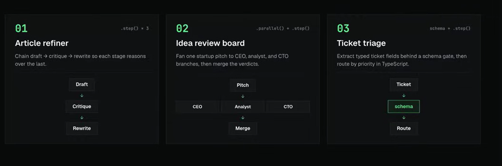

# AI Agent Pipeline Patterns

A TypeScript CLI learning project for exploring three common AI agent pipeline patterns through small, practical case studies built with the [Anvia SDK](https://github.com/anvia-hq/anvia).



## Overview

This project contains three case studies. Each one introduces a different way to compose AI-powered steps into a predictable workflow:

| # | Case study | Pipeline pattern | Anvia primitive | Flow |
|---|---|---|---|---|
| 01 | Article Refiner | Sequential pipeline | `.step()` × 3 | Draft → Critique → Rewrite |
| 02 | Idea Review Board | Parallel fan-out and merge | `.parallel()` + `.step()` | Pitch → CEO / Analyst / CTO → Merge |
| 03 | Ticket Triage | Structured extraction and routing | `.extract()` + `.step()` | Ticket → Schema → Route |

## Case Studies

### 01. Article Refiner

> Chain draft → critique → rewrite so each stage reasons over the last.

The Article Refiner demonstrates a three-step sequential Anvia `Pipeline` (`.step()` × 3). Each stage receives the result of the previous stage as its input.

```text
Draft
  ↓
Critique
  ↓
Rewrite
```

Stages:

1. **Draft** — generates or accepts an initial article draft.
2. **Critique** — reviews the draft and identifies weaknesses or possible improvements.
3. **Rewrite** — produces a refined article using both the draft and its critique.

Learning goals:

- Compose dependent AI steps sequentially.
- Pass typed context between pipeline stages.
- Separate content generation, evaluation, and revision responsibilities.
- Observe how the output of one agent influences the next agent.

### 02. Idea Review Board

> Fan one startup pitch to CEO, analyst, and CTO branches, then merge the verdicts.

The Idea Review Board demonstrates Anvia's parallel fan-out followed by a merge step (`.parallel() + .step()`). A single startup pitch is reviewed from three independent perspectives.

```text
                 ┌→ CEO ─────┐
Pitch ───────────┼→ Analyst ─┼→ Merge
                 └→ CTO ─────┘
```

Review branches:

- **CEO** — reviews vision, strategy, and business potential.
- **Analyst** — reviews market assumptions, evidence, risks, and viability.
- **CTO** — reviews technical feasibility, complexity, and scalability.
- **Merge** — combines the independent reviews into one final verdict.

Learning goals:

- Run independent AI tasks concurrently.
- Model fan-out/fan-in workflows.
- Preserve each reviewer's role and perspective.
- Merge multiple outputs into a coherent recommendation.

### 03. Ticket Triage

> Extract typed ticket fields behind a schema gate, then route by priority in TypeScript.

Ticket Triage demonstrates Anvia structured extraction followed by deterministic routing (`.extract() + .step()`). An unstructured support ticket must pass through a Zod schema gate before application code routes it.

```text
Ticket
  ↓
Schema
  ↓
Route
```

Stages:

1. **Ticket** — receives an unstructured support request.
2. **Schema** — extracts and validates typed ticket fields.
3. **Route** — uses TypeScript logic to route the validated ticket by priority.

Learning goals:

- Convert unstructured model output into typed data.
- Validate AI output before using it in application logic.
- Keep probabilistic extraction separate from deterministic routing.
- Handle invalid or incomplete model responses safely.

## Project Principles

The implementations in this repository should follow these principles:

- **Typed boundaries** — define explicit TypeScript types for every stage input and output.
- **Structured outputs** — validate model-generated data before consuming it.
- **Small, focused steps** — give every pipeline stage one clear responsibility.
- **Provider isolation** — use Anvia's provider-neutral runtime so workflow logic remains separate from the selected LLM provider.
- **Testability** — allow real model clients to be replaced by deterministic fakes in tests.
- **Observability** — expose stage results, errors, and execution time where useful.
- **Safe termination** — use explicit limits for any workflow that may retry or loop.

## Tech Stack

- TypeScript
- Node.js 20.12 or newer
- pnpm
- tsx for local execution
- [Anvia SDK](https://docs.anvia.dev/) for agents, structured extraction, and pipeline composition
- [Anvia Studio](https://docs.anvia.dev/) for visual workflow demos and pipeline inspection
- Zod for typed pipeline boundaries and structured output validation

The core pipeline runtime is provided by `@anvia/core`, while `@anvia/studio` provides the local visual inspection UI. A provider adapter such as `@anvia/openai`, `@anvia/anthropic`, `@anvia/gemini`, or `@anvia/mistral` will be selected separately, keeping the pipeline provider-neutral.

## Why Anvia

Anvia maps directly to the three patterns explored by this project:

- `Pipeline.step()` composes sequential transformations for Article Refiner.
- `Pipeline.parallel()` fans a pitch out to named reviewer branches for Idea Review Board.
- `Pipeline.extract()` turns an unstructured ticket into schema-validated data for Ticket Triage.
- `Pipeline.run()` executes the composed workflow and returns its typed output.
- `Studio` displays registered pipelines as inspectable workflow graphs for demonstrations.

The application remains responsible for creating provider clients, reading credentials from environment variables, and passing configured models into Anvia agents or extractors.

## Workflow Demos with Anvia Studio

The three workflows will be registered in Anvia Studio so their stages, branches, inputs, outputs, and execution logs can be inspected visually during demonstrations.

```ts
import { Studio } from "@anvia/studio";

new Studio([
  articleRefinerPipeline,
  ideaReviewBoardPipeline,
  ticketTriagePipeline,
]).start({ port: 4021 });
```

Each pipeline and step should define a stable `id`, readable `name`, and useful `description`. These values become part of the Studio presentation and make the workflow graph easier to understand.

The intended demo flow is:

1. Start Anvia Studio locally.
2. Open the Studio UI in a browser.
3. Select one of the registered pipelines.
4. Provide sample input and run the workflow.
5. Inspect the graph and the result of each stage.

Studio is a development and demonstration surface. The CLI remains the primary application interface, and both interfaces use the same pipeline instances as their source of truth.

## Getting Started

### Prerequisites

- Node.js
- pnpm

### Installation

```bash
pnpm install
```

Mode `mock` tidak membutuhkan API key. Untuk mode `live`, salin `.env-example` menjadi `.env` lalu isi:

```dotenv
OPENAI_API_KEY=your-key
OPENAI_API_BASE_URL=https://your-openai-compatible-endpoint/v1
LLM_MODEL=your-model-name
```

Jangan commit `.env` atau memasukkan credential ke source code maupun output.

### CLI help dan mock demos

```bash
pnpm dev --help

pnpm dev article-refiner --mode mock --file examples/article-brief.json
pnpm dev idea-review-board --mode mock --file examples/startup-pitch.txt
pnpm dev ticket-triage --mode mock --file examples/ticket-support.txt --json
```

Semua mock workflow deterministik dan tidak memanggil provider. Output JSON hanya berisi hasil workflow sehingga aman dipipe atau diproses program lain.

### Live mode

```bash
pnpm dev article-refiner --mode live --file examples/article-brief.json
pnpm dev idea-review-board --mode live --file examples/startup-pitch.txt
pnpm dev ticket-triage --mode live --file examples/ticket-support.txt --json
```

Live mode memerlukan ketiga variable environment di atas. Provider call bersifat opt-in dan dapat menimbulkan biaya.

### Menyimpan hasil

```bash
pnpm dev article-refiner \
  --mode mock \
  --file examples/article-brief.json \
  --json \
  --output outputs/article-result.json
```

`--output` membuat file baru dan menolak overwrite file yang sudah ada, lalu hanya mencetak lokasi file ke stdout. Hapus atau pindahkan file lama sebelum menjalankan command yang sama kembali. Setiap pipeline memiliki timeout 180 detik; `--timeout <ms>` dapat digunakan untuk override durasi satu run. Error transient tertentu mendapat maksimal satu retry tambahan. Article Refiner live menampilkan token hasil streaming pada stderr, sehingga output JSON di stdout tetap valid.

### Build dan tests

```bash
pnpm typecheck
pnpm test
pnpm build
```

Build menghasilkan artifact di `dist/`. Test otomatis tidak membutuhkan internet atau credential.

### Anvia Studio

```bash
pnpm studio --mode mock
```

Buka `http://127.0.0.1:4021/playground`. Studio mendaftarkan ketiga pipeline dari registry yang sama dengan CLI. Gunakan mode `live` hanya setelah konfigurasi provider tersedia:

```bash
pnpm studio --mode live
```

Studio dibind ke loopback untuk penggunaan lokal. Jangan mengeksposnya ke jaringan publik tanpa kontrol akses.

## Implementation Roadmap

Status implementasi:

1. **Article Refiner** — `[x]` sequential composition dan context passing.
2. **Idea Review Board** — `[x]` parallel execution dan result aggregation.
3. **Ticket Triage** — `[x]` schema validation dan deterministic routing.
4. **Finalisasi M6** — `[~]` CLI, output file, timeout/retry policy, dokumentasi, dan live CLI smoke test ketiga workflow selesai; verifikasi error provider serta inspeksi run live melalui Studio tetap opt-in/pending.


Project saat ini memiliki tiga workflow yang dapat dijalankan dari CLI dan Studio dalam mode `mock`. Mode `live` sudah memiliki wiring provider OpenAI-compatible dan telah diverifikasi melalui smoke test CLI dengan provider nyata; pemanggilan provider tetap opt-in dan bukan bagian dari test otomatis.
